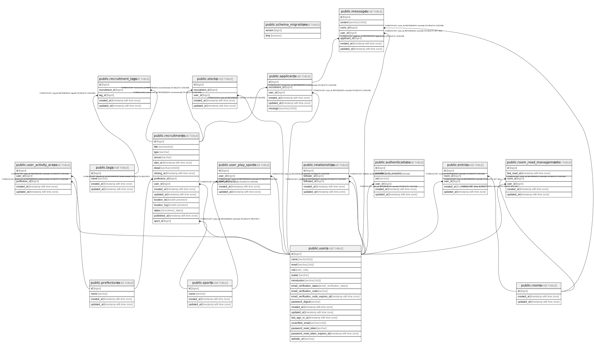

# connefut_db

## Tables

| Name | Columns | Comment | Type |
| ---- | ------- | ------- | ---- |
| [public.schema_migrations](public.schema_migrations.md) | 2 |  | BASE TABLE |
| [public.users](public.users.md) | 16 |  | BASE TABLE |
| [public.prefectures](public.prefectures.md) | 4 |  | BASE TABLE |
| [public.sports](public.sports.md) | 4 |  | BASE TABLE |
| [public.recruitments](public.recruitments.md) | 16 |  | BASE TABLE |
| [public.stocks](public.stocks.md) | 5 |  | BASE TABLE |
| [public.applicants](public.applicants.md) | 6 |  | BASE TABLE |
| [public.tags](public.tags.md) | 4 |  | BASE TABLE |
| [public.recruitment_tags](public.recruitment_tags.md) | 5 |  | BASE TABLE |
| [public.rooms](public.rooms.md) | 3 |  | BASE TABLE |
| [public.messages](public.messages.md) | 7 |  | BASE TABLE |
| [public.entries](public.entries.md) | 5 |  | BASE TABLE |
| [public.room_read_managements](public.room_read_managements.md) | 6 |  | BASE TABLE |
| [public.relationships](public.relationships.md) | 5 |  | BASE TABLE |
| [public.authentications](public.authentications.md) | 6 |  | BASE TABLE |

## Stored procedures and functions

| Name | ReturnType | Arguments | Type |
| ---- | ------- | ------- | ---- |
| public.uuid_nil | uuid |  | FUNCTION |
| public.uuid_ns_dns | uuid |  | FUNCTION |
| public.uuid_ns_url | uuid |  | FUNCTION |
| public.uuid_ns_oid | uuid |  | FUNCTION |
| public.uuid_ns_x500 | uuid |  | FUNCTION |
| public.uuid_generate_v1 | uuid |  | FUNCTION |
| public.uuid_generate_v1mc | uuid |  | FUNCTION |
| public.uuid_generate_v3 | uuid | namespace uuid, name text | FUNCTION |
| public.uuid_generate_v4 | uuid |  | FUNCTION |
| public.uuid_generate_v5 | uuid | namespace uuid, name text | FUNCTION |

## Relations

---

> Generated by [tbls](https://github.com/k1LoW/tbls)
