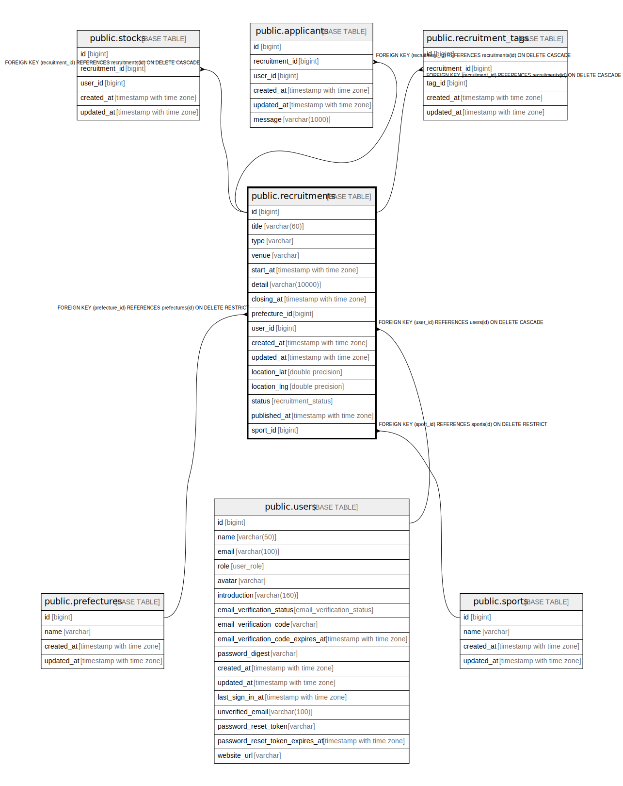

# public.recruitments

## Description

## Columns

| Name | Type | Default | Nullable | Children | Parents | Comment |
| ---- | ---- | ------- | -------- | -------- | ------- | ------- |
| id | bigint | nextval('recruitments_id_seq'::regclass) | false | [public.stocks](public.stocks.md) [public.applicants](public.applicants.md) [public.recruitment_tags](public.recruitment_tags.md) |  |  |
| title | varchar(60) |  | false |  |  |  |
| type | varchar |  | false |  |  |  |
| venue | varchar |  | true |  |  |  |
| start_at | timestamp with time zone |  | true |  |  |  |
| detail | varchar(10000) |  | true |  |  |  |
| closing_at | timestamp with time zone |  | true |  |  |  |
| competition_id | bigint |  | false |  | [public.competitions](public.competitions.md) |  |
| prefecture_id | bigint |  | false |  | [public.prefectures](public.prefectures.md) |  |
| user_id | bigint |  | false |  | [public.users](public.users.md) |  |
| created_at | timestamp with time zone |  | false |  |  |  |
| updated_at | timestamp with time zone |  | false |  |  |  |
| location_lat | double precision |  | true |  |  |  |
| location_lng | double precision |  | true |  |  |  |
| status | recruitment_status | 'draft'::recruitment_status | false |  |  |  |
| published_at | timestamp with time zone |  | true |  |  |  |

## Constraints

| Name | Type | Definition |
| ---- | ---- | ---------- |
| recruitments_user_id_fkey | FOREIGN KEY | FOREIGN KEY (user_id) REFERENCES users(id) ON DELETE CASCADE |
| recruitments_prefecture_id_fkey | FOREIGN KEY | FOREIGN KEY (prefecture_id) REFERENCES prefectures(id) ON DELETE RESTRICT |
| recruitments_competition_id_fkey | FOREIGN KEY | FOREIGN KEY (competition_id) REFERENCES competitions(id) ON DELETE RESTRICT |
| recruitments_pkey | PRIMARY KEY | PRIMARY KEY (id) |

## Indexes

| Name | Definition |
| ---- | ---------- |
| recruitments_pkey | CREATE UNIQUE INDEX recruitments_pkey ON public.recruitments USING btree (id) |
| recruitments_user_id_idx | CREATE INDEX recruitments_user_id_idx ON public.recruitments USING btree (user_id) |
| recruitments_prefecture_id_idx | CREATE INDEX recruitments_prefecture_id_idx ON public.recruitments USING btree (prefecture_id) |
| recruitments_competition_id_idx | CREATE INDEX recruitments_competition_id_idx ON public.recruitments USING btree (competition_id) |

## Relations

---

> Generated by [tbls](https://github.com/k1LoW/tbls)
