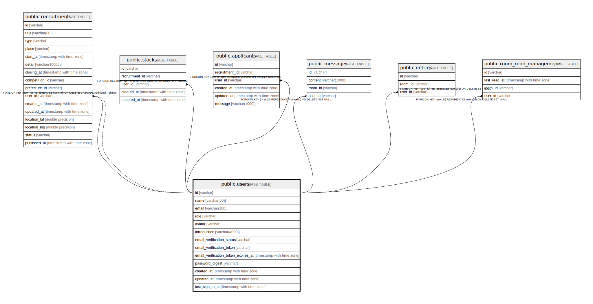

# public.users

## Description

## Columns

| Name | Type | Default | Nullable | Children | Parents | Comment |
| ---- | ---- | ------- | -------- | -------- | ------- | ------- |
| id | varchar |  | false | [public.recruitments](public.recruitments.md) [public.stocks](public.stocks.md) [public.applicants](public.applicants.md) [public.messages](public.messages.md) [public.entries](public.entries.md) [public.room_read_managements](public.room_read_managements.md) |  |  |
| name | varchar(50) |  | false |  |  |  |
| email | varchar(100) |  | false |  |  |  |
| role | varchar | 'general'::character varying | false |  |  |  |
| avatar | varchar | 'https://abs.twimg.com/sticky/default_profile_images/default_profile.png'::character varying | false |  |  |  |
| introduction | varchar(4000) |  | true |  |  |  |
| email_verification_status | varchar | 'pending'::character varying | false |  |  |  |
| email_verification_token | varchar |  | true |  |  |  |
| email_verification_token_expires_at | timestamp with time zone |  | true |  |  |  |
| password_digest | varchar |  | true |  |  |  |
| created_at | timestamp with time zone |  | false |  |  |  |
| updated_at | timestamp with time zone |  | false |  |  |  |
| last_sign_in_at | timestamp with time zone |  | true |  |  |  |

## Constraints

| Name | Type | Definition |
| ---- | ---- | ---------- |
| users_pkey | PRIMARY KEY | PRIMARY KEY (id) |
| users_email_key | UNIQUE | UNIQUE (email) |

## Indexes

| Name | Definition |
| ---- | ---------- |
| users_pkey | CREATE UNIQUE INDEX users_pkey ON public.users USING btree (id) |
| users_email_key | CREATE UNIQUE INDEX users_email_key ON public.users USING btree (email) |
| users_email_verification_token_idx | CREATE INDEX users_email_verification_token_idx ON public.users USING btree (email_verification_token) |

## Relations

---

> Generated by [tbls](https://github.com/k1LoW/tbls)
